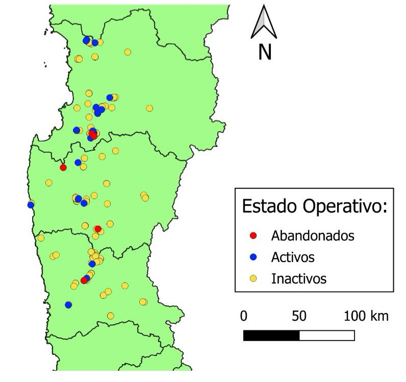

# Estimación de Concentraciones de Metales Pesados en Depósitos de Relaves usando Imágenes Satelitales Multiespectrales

## Descripción
Este repositorio contiene el código y los datos utilizados en la tesis de Magíster en Ciencia de Datos, titulada "Estimación de concentraciones de metales pesados en depósitos de relaves a partir de imágenes satelitales multiespectrales" realizada por Tomás Ignacio Contreras Delporte en la Universidad Adolfo Ibáñez. El trabajo se centra en la estimación de las concentraciones de metales pesados como Cu, Ni, Zn, Co y As en depósitos de relaves en la Región de Coquimbo, Chile, utilizando imágenes satelitales multiespectrales.

Para una mejor experiencia, analizar el informe previo al analisis del código.

## Objetivo
El objetivo principal de este proyecto es evaluar la viabilidad de usar imágenes satelitales para estimar las concentraciones de metales pesados en depósitos de relaves mineros. A través de un análisis de regresión y el uso de diferentes modelos estadísticos y de machine learning, se busca identificar patrones en los datos espectrales de las imágenes para realizar estimaciones precisas.

## Metodología
1) **Área de Estudio:** Región de Coquimbo, Chile, con un enfoque en depósitos de relaves activos, inactivos y abandonados.

2) **Adquisición de Datos:**

  - Datos Satelitales: Imágenes multiespectrales obtenidas de satélites Landsat 8.

  - Datos de Concentraciones de Metales: Información histórica proporcionada por Sernageomin.

3) **Preprocesamiento de Datos:** Se realiza un preprocesamiento de las imágenes satelitales para asegurar la calidad de los datos espectrales, aplicando correcciones geométricas y radiométricas.

4) **Modelado Predictivo:** Uso de modelos estadísticos como Partial Least-Squares Regression (PLSR), Generalized Linear Models (GLM), y Generalized Additive Models (GAM) para estimar las concentraciones de metales pesados.

## Resultados
El modelo Partial Least Square Regression (PLSR) mostró ser más efectivo para la estimación de concentraciones de Zn, mientras que el Generalized Linear Models (GLM) mostró un rendimiento superior en la estimación de metales como Ni, Cu, y As.

La metodología permitió identificar que las concentraciones de metales no son determinantes en la precisión de las estimaciones, destacando la importancia de las correlaciones y los valores extremos en los modelos predictivos.

## Requisitos
- Python 3.x
- Bibliotecas:
  - 
  - 
  - 
  - 
  - 
  - 
  - 
  - 

## Creditos y agradecimientos
Este proyecto fue posible gracias al apoyo y colaboración de diversas personas. Agradecimiento especial al profesor Javier Lopatin por su guía y conocimientos durante el desarrollo de este trabajo. Asimismo, reconocimiento al profesor Raúl O'Ryan, a Osvaldo Ramirez y a José Tomás Morel.
